# Credit_Risk_Analysis

## Purpose
The purpose of this exercise is to use resampling models, the SMOTEENN algorithm, and ensemble classifiers to predict credit risk.

We will be using imblanced-learn and scikit-learn libraries to build and evaluate models using resampling. Using the credit card credit dataset from LendingClub, a peer-to-peer lending services company, you’ll oversample the data using the RandomOverSampler and SMOTE algorithms, and undersample the data using the ClusterCentroids algorithm. Then, you’ll use a combinatorial approach of over- and undersampling using the SMOTEENN algorithm. Next, you’ll compare two new machine learning models that reduce bias, BalancedRandomForestClassifier and EasyEnsembleClassifier, to predict credit risk. Once you’re done, you’ll evaluate the performance of these models and make a written recommendation on whether they should be used to predict credit risk.

## Results
Below you can reference the accuracy score, as well as the precision and recall scores for all six macihne learning models:

### Naive Random Oversampling:
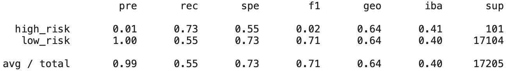
- **Percision:** 0.99
- **Recall:** 0.55
- **F1 Score:** 0.71
- **Balanced Accuracy Score:**
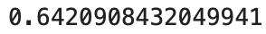

### SMOTE Oversampling:
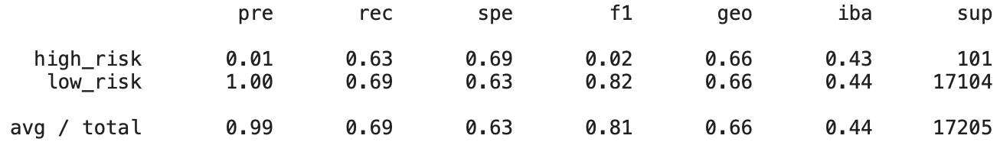
- **Percision:** 0.99
- **Recall:** 0.69
- **F1 Score:** 0.81
- **Balanced Accuracy Score:**
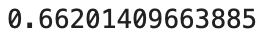

### Cluster Centroids Undersampling:
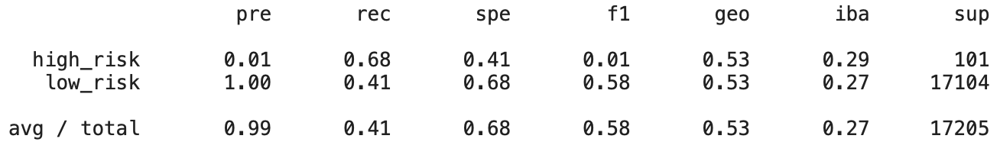
- **Percision:** 0.99
- **Recall:** 0.41
- **F1 Score:** 0.58
- **Balanced Accuracy Score:**
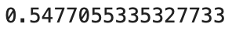

### Combination (Over and Under) Sampling:
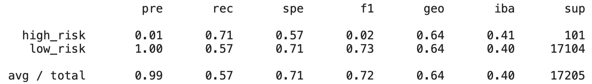
- **Percision:** 0.99
- **Recall:** 0.57
- **F1 Score:** 0.72
- **Balanced Accuracy Score:**
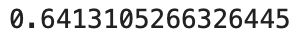

### Balanced Random Forest Classifier:
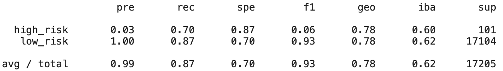
- **Percision:** 0.99
- **Recall:** 0.87
- **F1 Score:** 0.93
- **Balanced Accuracy Score:**
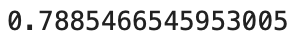

### Easy Ensemble AdaBoost Classifier:
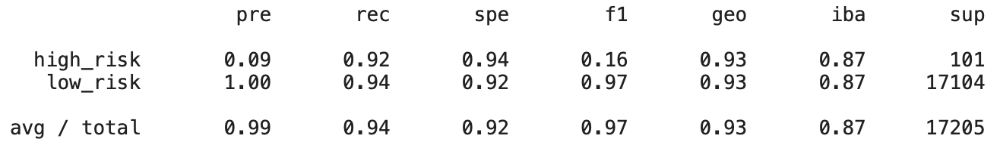
- **Percision:** 0.99
- **Recall:** 0.94
- **F1 Score:** 0.97
- **Balanced Accuracy Score:**
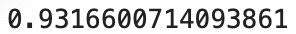

## Summary
Since all of these models return a 99% preceision score, indicating they are all viable options to assess credit risk.

That being said, I would choose the Easy Ensemble AdaBoost Classifer as my model because it returns the highest balanced accuracy score.